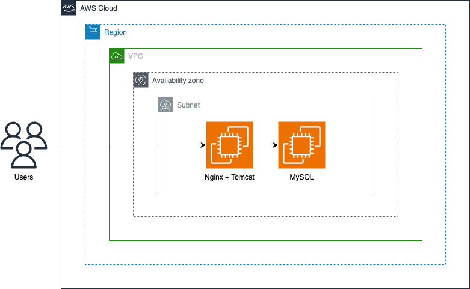
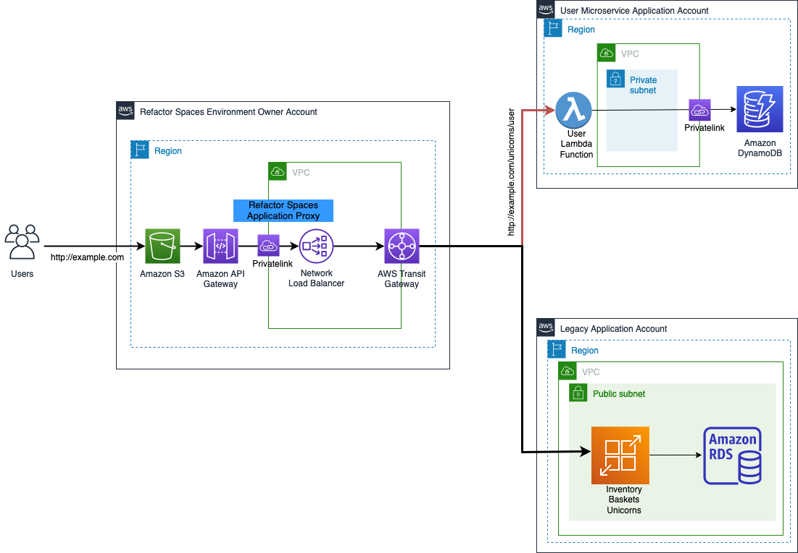

## Identificação da Pesquisa

- Tema Geral: Análise do Processo de Migração de Arquiteturas Monolíticas para Soluções Desacopladas
- Delimitação do Tema: Como a refatoração de projetos de software com base monolítica para soluções desacopladas e o uso de padrões de arquitetura limpa podem reduzir a interdependência entre os componentes e contribuir para a criação de sistemas mais flexíveis e adaptáveis.
- Nome do Orientador(a): Ana Carolina Sokolonski Anton
- Nome do Co-orientador(a):
- Aluno(a): Diogo Mascarenhas Ferreira Santos
- Curso: Bacharelado em Sistemas de Informação (BSI)

## Pergutas a serem respondidas no Projeto de Pesquisa

### Introdução

- **Qual seu objeto (tema) de pesquisa?**

Refatoração de projetos de software com base monolítica para soluções desacopladas, buscando reduzir a interdependência entre os componentes, aplicando refatoração e uso de padrões de arquitetura limpa podem contribuir para a criação de sistemas mais flexíveis e adaptáveis.

- **Qual seu problema de pesquisa?**

Em um ambiente produtivo, um sistema monolítico e com referências externas na lógica interna, ou seja, fortemente acoplado, pode abranger desde uma aplicação Web até um SaaS com uma base de usuários ativa. Em determinado momento, pode ser necessário refatorá-lo ou reescrevê-lo em outra pilha tecnológica devido a custos, licenciamento ou manutenção. No entanto, como não é possível modificar diretamente o monólito, a necessidade de implementar novas funcionalidades sem alterar seu código exige uma estratégia cuidadosa. A exemplo, a aplicação do padrão Strangler Fig pode ser uma solução para esse problema, permitindo a migração incremental de funcionalidades para microsserviços ou outras arquiteturas, sem comprometer o funcionamento do sistema ou a experiência dos usuários que ainda dependem do serviço.

- **Qual a justificativa?**

A crescente necessidade de sistemas de software mais escaláveis, flexíveis e fáceis de manter. Arquiteturas monolíticas podem se tornar um gargalo para o desenvolvimento e a inovação, especialmente em grandes corporações. A migração para arquiteturas desacopladas, como microsserviços, pode trazer benefícios como maior agilidade no desenvolvimento e melhor utilização de recursos. Além disso, a aplicação de padrões de refatoração e arquitetura limpa pode melhorar a qualidade do código e facilitar a adaptação a novas tecnologias e requisitos. Práticas como injeção de dependência (dependency injection) podem ser aplicadas tanto em novos projetos quanto em sistemas já existentes, promovendo um baixo acoplamento e maior testabilidade bem como o padrão Strangler Fig também pode ser utilizado para migrar funcionalidades de forma incremental, garantindo que o sistema continue operando sem interrupções durante o processo de refatoração.

- **Qual a problematização?**
  .
  - A complexidade de migrar um sistema monolítico para uma arquitetura desacoplada sem interromper o funcionamento do sistema existente e, ao mesmo tempo, minimizar os riscos dessa transição.
  - A necessidade de uma estratégia que permita a reescrita de funcionalidades de forma incremental, sem afetar os consumidores do sistema, é um desafio central.
  - O uso do padrão Strangler Fig é uma solução, mas é necessário analisar os seus desafios e implicações em um contexto prático.  
    .
- **Qual seu referencial teórico?**

O referencial teórico será construído sobre conceitos de arquitetura de software, incluindo:

- Arquitetura Monolítica e Microsserviços;
- Arquitetura Limpa;
- Padrões de Refatoração e o padrão Strangler Fig;
- Injeção de Dependência.

Se apoiando em autores como Robert Martin (com foco em Arquitetura Limpa e princípios SOLID) e Martin Fowler (com foco em padrões de arquitetura e refatoração).

- **Quais seus objetivos: geral e específico?**

  - **Geral:** Analisar e demonstrar na prática o processo de migração de um sistema monolítico para uma arquitetura desacoplada, utilizando padrões de refatoração e princípios da arquitetura limpa, com foco no padrão Strangler Fig
  - **Especifico:** - Implementar um projeto simples em Java 8 com banco de dados representando um sistema monolítico. - Aplicar o padrão Strangler Fig para refatoracao parcial do projeto e migrar a(s) funcionalidades do sistema monolítico para uma nova solução. - Demonstrar o uso da injeção de dependência para desacoplar componentes do sistema. - Avaliar os desafios e benefícios da aplicação do padrão Strangler Fig no contexto do projeto desenvolvido. - Analisar a relação entre a aplicação dos princípios da arquitetura limpa e o desacoplamento do software. - Apresentar um guia prático para a refatoração de sistemas monolíticos, com base nas experiências do projeto.
    .

- **Como você irá apresentar sua fundamentação teórica?**

A fundamentação teórica será organizada em seções que abordarão os seguintes aspectos:

- **Revisão Bibliográfica**: Exploração do tema com base em pesquisas e materiais de auxílio para a elaboração de um estudo bibliográfico sobre as técnicas e padrões utilizados para a elaboração da arquitetura do sistema.
- **Conceitos de Arquitetura de Software**: Apresentação de arquiteturas monolíticas e microsserviços, seus benefícios e desafios.
- **Padrões de Arquitetura**: Definição do padrão Strangler Fig, seu funcionamento e sua aplicação em projetos de migração.
- **Princípios da Arquitetura Limpa**: Explicação dos princípios SOLID e sua importância para a criação de software manutenível e flexível.
- **Refatoração de Software**: Definição de refatoração, seus objetivos e padrões, com foco em como a refatoração pode auxiliar na migração de sistemas monolíticos.
- **Injeção de Dependência**: Apresentação do conceito e sua importância para o desacoplamento do código.
- **Estudos de Caso**: Análise de estudo de caso com projeto local simples de migração de sistemas monolíticos para solucao desacoplada, com foco em lições aprendidas e desafios encontrados.
- **Metodologia de Migração**: Detalhes do método a ser usado na sua pesquisa, baseado do blog de Martin Fowler e em outros trabalhos sobre o padrão Strangler Fig.

Este detalhamento deverá proporcionar uma base sólida para o desenvolvimento do projeto de pesquisa, permitindo a exploração de forma clara e organizada os desafios e benefícios da migração de arquiteturas monolíticas para soluções desacopladas.

### Fundamentação Teórica:

**Qual sua revisão de literatura?**

A revisão de literatura será estruturada com base em três eixos principais:

1. **Arquiteturas Monolíticas vs. Soluções Desacopladas**:

   - Discussão sobre as limitações das arquiteturas monolíticas (e.g., acoplamento elevado, dificuldade de escalar componentes individuais, complexidade na manutenção) e os benefícios das arquiteturas desacopladas (e.g., microsserviços, modularidade, independência de tecnologias).
   - Referências: Martin Fowler ("MonolithFirst").

2. **Padrões de Migração e Refatoração**:

   - Análise do padrão **Strangler Fig** como estratégia para substituição incremental de funcionalidades, com exemplos práticos.
   - Discussão sobre **Injeção de Dependência** e **Arquitetura Limpa** (Robert C. Martin) para reduzir acoplamento e aumentar a testabilidade.
   - Referências: Artigos/Livros de Martin Fowler sobre refatoração, capítulos de "Clean Architecture" (Robert C. Martin).

3. **Desafios Técnicos e Organizacionais**:
   - Crítica aos riscos de migrações abruptas (e.g., downtime, inconsistência de dados) e a importância de abordagens iterativas.
   - Estudos que evidenciam a relação entre baixo acoplamento e redução de custos de manutenção.

**Como irá explicar, discutir e apresentar seu assunto? Exponha os fundamentos do seu estudo.**

O estudo será apresentado com base nos seguintes pilares teóricos:

1. **Acoplamento e Coesão**:

   - Definição de acoplamento (forte vs. fraco) e coesão (alta vs. baixa), relacionando-os à flexibilidade do software.
   - Exemplos de como sistemas monolíticos tendem a violar esses princípios (e.g., dependências diretas entre módulos).

2. **Arquitetura Limpa e SOLID**:

   - Princípios SOLID como base para desacoplamento (e.g., Inversão de Dependência, Segregação de Interfaces).
   - Diagramas da Arquitetura Limpa, mostrando camadas independentes (entities, use cases, interfaces).

3. **Strangler Fig na Prática**:

   - Funcionamento do padrão: criação de uma "camada intermediária" que redireciona gradualmente requisições do monólito para novos serviços.
   - Estudo de Caso desenvolvendo um pequeno projeto.

4. **Injeção de Dependência**:
   - Exemplo prático em Java: substituição de chamadas diretas a classes por interfaces, usando frameworks como Spring ou Guice.

Para sair disso:

  

para isso:

  

**Quais aspectos teóricos justificam sua pesquisa?**

A pesquisa é justificada pela necessidade de sistemas de software mais flexíveis, escaláveis e manuteníveis. Uma arquitetura "pobre" pode se tornar um obstáculo para o desenvolvimento e a inovação, especialmente em grandes corporações com projetos já existentes. Como devende Martin Fowler (2015) "1. Quase todas as histórias de microsserviços bem-sucedidas começaram com um monólito que ficou muito grande e foi dividido."

A aplicação de padrões de refatoração, como o Strangler Fig, e os princípios da arquitetura limpa e injeção de dependência melhoram a qualidade do código, facilitam a adaptação a novas tecnologias e reduzem a complexidade.

A migração incremental minimiza os riscos e interrupções do sistema, permitindo a implementação de novas funcionalidades sem afetar os consumidores do sistema existente.

Os conceitos de acoplamento e coesão são importantes na pesquisa, mostrando como um software com baixo acoplamento e alta coesão pode ser mais facilmente modificado e reutilizado.

**Quais e quantas sessões você irá utilizar para organizar a apresentação da sua fundamentação teórica?**

### Elementos pós-textuais:

Referências

---

Links Uteis:

- [AWS Prescriptive Guidance: Strangler Fig](https://docs.aws.amazon.com/pt_br/prescriptive-guidance/latest/cloud-design-patterns/strangler-fig.html) - Guia da AWS sobre o padrão Strangler Fig para migração de sistemas.
- [AWS Workshops: Strangler Fig](https://catalog.us-east-1.prod.workshops.aws/workshops/f2c0706c-7192-495f-853c-fd3341db265a/pt-BR) - Workshop da AWS sobre a aplicação do padrão Strangler Fig para migração de sistemas.
- [Martin Fowler: Dependency Injection](https://martinfowler.com/articles/injection.html) - Artigo de Martin Fowler explicando o conceito de injeção de dependência.
- [Martin Fowler: Strangler Fig Application](https://martinfowler.com/bliki/StranglerFigApplication.html) - Discussão de Martin Fowler sobre a aplicação do padrão Strangler Fig.
- [Martin Fowler: MonolithFirst](https://martinfowler.com/bliki/MonolithFirst.html) - Discussão de Martin Fowler sobre a abordagem de começar com uma arquitetura monolítica antes de migrar para microsserviços.
- [Clean Coder Blog: The Clean Architecture](https://blog.cleancoder.com/uncle-bob/2012/08/13/the-clean-architecture.html) - Postagem no blog de Robert C. Martin sobre a arquitetura limpa.
